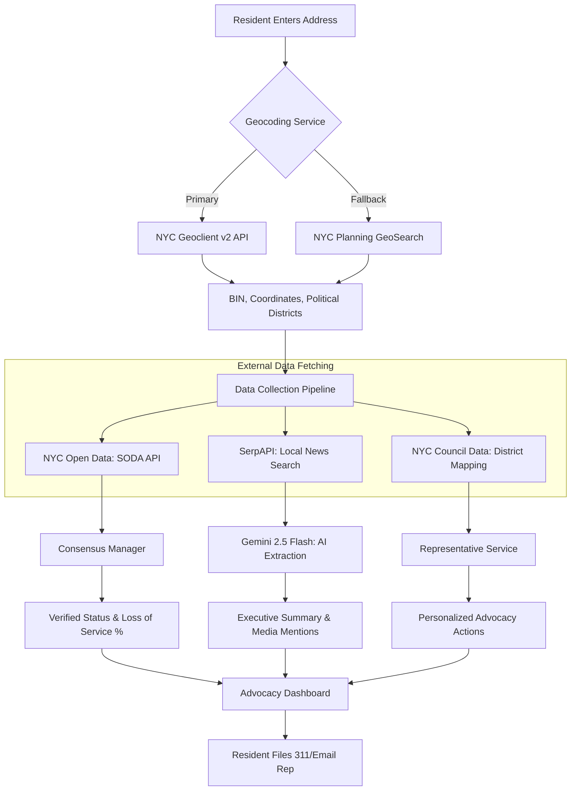

# NYC Tenant Elevator Advocacy Platform
## "Dignity Through Data"

Hi, I’m **Karl Johnson**, a resident of District 17 in the Bronx. I am building this platform as a gift of service to my community—born from the daily reality of watching my neighbors, many of whom are seniors or rely on wheelchairs, rendered immobile and oppressed by failing elevators.

In my building, elevator outages aren't just maintenance issues; they are a crisis of mobility and human dignity. I’ve seen neighbors confined to their floors for days, weeks, and even months. This project, developed during my AI-Native fellowship at **Pursuit**, is my response to that anguish. It is a tool designed to transform personal grievance into a scalable engine for collective advocacy and survival.

---

## ✊ The Mission
The goal is simple: **Close the information gap between residents and property owners.** 

Currently, the city's 311 reporting system is high-friction, and official NYC Open Data (SODA) records often suffer from reporting lags that make them unusable for life-safety decisions. This platform restores dignity to residents by providing:

- **Verified Transparency**: Outages are "Verified" only when multiple residents report them within a rolling 2-hour window, creating an undeniable record of truth.
- **Quantified Advocacy**: We calculate a unique **"Loss of Service" (LoS) %** metric—translating raw downtime into hard data that can be used in Housing Court or legislative briefings.
- **Strategic Mobilization**: We map buildings to their specific NYC Council Districts, providing residents with AI-powered 311 scripts and direct "Email Representative" workflows to trigger formal accountability.
- **Support Networks**: Real-time status updates keep care providers and family members informed about their loved ones’ accessibility status.

## 🛠️ How It Works: The Data Synthesis Engine
The platform acts as a reasoning layer that correlates real-time tenant observations with official city records.



### Core Logic
1.  **The 2-Hour Consensus Rule**: To prevent data noise, an elevator status remains unverified until a second observation is logged by a different `user_id` for the same building within a 2-hour window.
2.  **Identity Resolution**: Every address is resolved to a unique **Building Identification Number (BIN)** via NYC Geoclient. This ensures that advocacy data is pinned to a physical structure, not just a fuzzy string.
3.  **Agentic Analysis**: We use a **Supervisor-Worker** pattern (powered by Gemini 2.5 Flash) to analyze building history and local news, suggesting specific legal or community organizing steps based on NYC housing law.

---

## 💻 Tech Stack
I selected these technologies to ensure a decoupled, performant, and type-safe environment suitable for a critical civic tool:

- **Backend**: Django 6.0 (utilizing `GeneratedField` and `db_default`), DRF, PostgreSQL.
- **Frontend**: React 19 (using `use()` and `useOptimistic()`), TypeScript, Vite, Tailwind CSS.
- **Orchestration**: Custom Python-based multi-agent system using Gemini 2.5 Flash.
- **Package Management**: `uv` for Python (extremely fast, reproducible environments).
- **Standards**: Strict PEP-8 compliance via **Ruff**, and full type-safety with `django-stubs`.

---

## 🚀 Getting Started

### Prerequisites
- Python 3.12+ 
- `uv` (Installed via `curl -LsSf https://astral.sh/uv/install.sh`)
- Node.js 20+

### Quick Setup
1. **Backend**:
   ```bash
   cd backend
   uv sync
   cp .env.example .env # Add your NYC Open Data & Gemini keys
   uv run python manage.py migrate
   uv run python manage.py runserver
   ```
2. **Frontend**:
   ```bash
   cd frontend
   npm install
   npm run dev
   ```
3. **Validation**:
   Run `./backend/scripts/pre_flight.sh` to ensure the full suite (Ruff + Mypy + Pytest) is passing.

---

## 📈 Strategic Path Forward
We aren't just building an app; we are building a **Power Block**. Our strategy involves:
- **Direct Legislative Briefings**: Providing Councilmembers (like Justin Sanchez) with LoS reports to trigger DOB inquiries.
- **Legal Integration**: Partnering with **Mobilization for Justice (MFJ)** to ensure LoS data is legally admissible in court.
- **Grassroots Organizing**: Aligning with **CASA** and **Mothers on the Move** to integrate reporting into existing tenant unions.

**Data is power.** By moving from anecdote to evidence, we ensure that accessibility is treated not as a whim of management, but as a fundamental human right.

---
*For detailed architectural documentation, see [docs/spec.md](./docs/spec.md) and [GEMINI.md](./GEMINI.md).*
