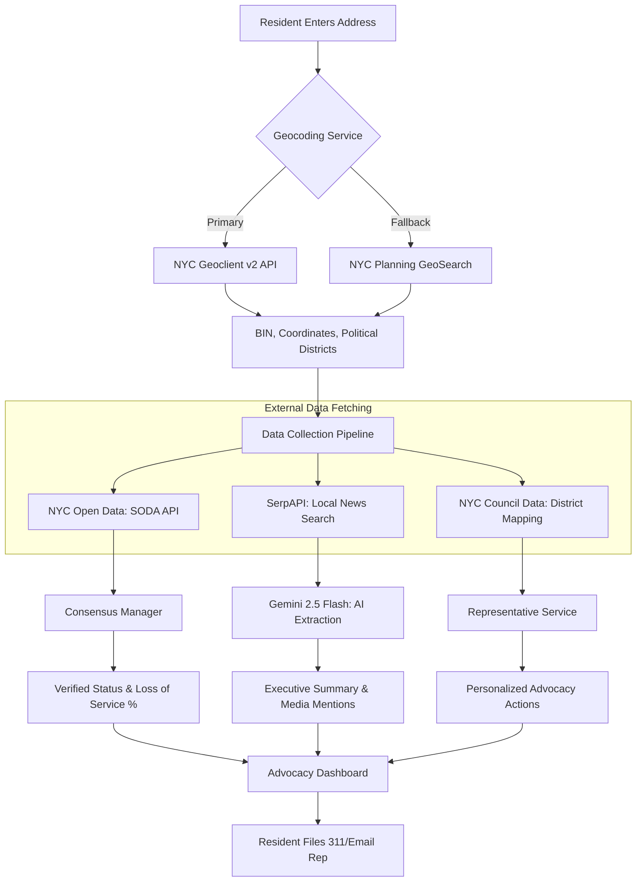

# Elevator Advocate
## NYC Tenant Elevator Advocacy Platform · "Dignity Through Data"

**Live platform → [elevatoradvocate.nyc](https://elevatoradvocate.nyc)**

Hi, I'm **Karl Johnson**, a resident of District 17 in the Bronx. I am building this platform as a gift of service to my community—born from the daily reality of watching my neighbors, many of whom are seniors or rely on wheelchairs, rendered immobile and oppressed by failing elevators.

In my building, a broken elevator is more than a maintenance delay—it's a crisis that strips people of their mobility and dignity. I've seen neighbors trapped on their floors for weeks at a time. This project, started during my AI-Native fellowship at **[Pursuit](https://pursuit.org)**, is my response. We are turning these daily frustrations into the hard data needed for collective advocacy and survival.

---

## Table of Contents

1. [Find Your Path](#-find-your-path)
2. [The Mission](#-the-mission)
3. [The Stakes: Why This Matters](#-the-stakes-why-this-matters)
4. [How It Works: The Data Synthesis Engine](#️-how-it-works-the-data-synthesis-engine)
5. [Accessibility & Inclusive Design](#️-accessibility--inclusive-design-the-martha-first-protocol)
6. [The Systemic Data Gap](#️-the-systemic-data-gap-a-barrier-to-justice)
7. [Data Research & Insights](#-data-research--insights)
8. [Multi-Agent Development: How This Was Built](#-multi-agent-development-how-this-was-built)
9. [Tech Stack](#-tech-stack)
10. [Localization](#-localization)
11. [Getting Started](#-getting-started)
12. [Strategic Path Forward](#-strategic-path-forward)

---

## 🗺 Find Your Path

Different readers come here for different reasons. Here's where to focus.

| You are… | Start here | Key links |
|---|---|---|
| **A local rep or staffer** | [The Stakes](#-the-stakes-why-this-matters) → [Data Research](#-data-research--insights) → [Strategic Path](#-strategic-path-forward) | [District 17 Pilot Brief](./docs/advocacy/district_17_pilot.md) · [Legislative Briefing Template](./docs/advocacy/legislative_briefing_template.md) · [Outreach Docs](./docs/advocacy/) |
| **A community org or tenant advocate** | [The Mission](#-the-mission) → [How It Works](#️-how-it-works-the-data-synthesis-engine) → [Live Platform](https://elevatoradvocate.nyc) | [Pilot Synthesis](./docs/advocacy/pilot_synthesis_summary.md) · [Council Coalition Plan](./docs/council_coalition.md) |
| **A Pursuit peer or fellow** | [Multi-Agent Development](#-multi-agent-development-how-this-was-built) → [Tech Stack](#-tech-stack) → [Getting Started](#-getting-started) | [Agent Definitions](./.claude/agents/) · [Sprint 13 Active](./.sprints/active/sprint_13_building_health_reports.md) · [Architecture Spec](./docs/spec.md) |
| **A civic data person** | [Data Research](#-data-research--insights) → [How It Works](#️-how-it-works-the-data-synthesis-engine) → [Data Stories Page](https://elevatoradvocate.nyc/data) | [Research Scripts](./scripts/data_research/) · [Knowledge Base](./.knowledge_base/) · [SODA Dataset `kqwi-7ncn`](https://data.cityofnewyork.us/resource/kqwi-7ncn.json) |

---

## ✊ The Mission

The goal is simple: **Close the information gap between residents and property owners.**

Currently, the city's 311 system is slow, and official NYC Open Data (SODA) often lags behind reality. This platform helps residents by providing:

- **Real-time Verification**: Outages are "Verified" only when multiple residents report them within two hours, creating a record that landlords can't ignore.
- **Service Metrics**: We calculate a **"Loss of Service" (LoS) %**—turning downtime into the kind of data used in Housing Court or legislative briefings.
- **Direct Advocacy**: We map buildings to NYC Council Districts and provide residents with AI-powered 311 scripts and direct email links to their representatives.
- **Support Networks**: Status updates help family members and care providers know if their loved ones can actually get in and out of their building.

---

## 🥀 The Stakes: Why This Matters

Accessibility is a life-safety issue. Recent data and reporting from early 2026 reveal the lethal cost of the status quo:

- **Lethal Isolation**: In 2025, a Bronx resident passed away during a heat wave because they were physically unable to leave their 4th-floor apartment during an extended elevator outage.
- **Seniors "Imprisoned"**: At Surfside Gardens in Coney Island, seniors like Aleksandra (79) and Valeriy (85) reported 47 outages in a single year, missing critical medical appointments and being unable to access food.
- **The Month-Long Outage**: In Queens, a 100-year-old resident was trapped in her home for over 30 days due to management's failure to perform repairs.

**Data is the only way to prove these aren't "isolated incidents."**

> For a full synthesis of local pilot findings, see [docs/advocacy/pilot_synthesis_summary.md](./docs/advocacy/pilot_synthesis_summary.md).

---

## 🛠️ How It Works: The Data Synthesis Engine

The platform acts as a reasoning layer that correlates real-time tenant observations with official city records. Try it live at [elevatoradvocate.nyc](https://elevatoradvocate.nyc).



### Core Logic

1. **The 2-Hour Consensus Rule**: To cut through the noise, an outage is "Verified" only after two different residents report it within a two-hour window.
2. **Identity Resolution**: We link every report to a specific physical building (using its Building Identification Number) so our data holds up in court or a council meeting.
3. **Agentic Analysis**: We use a supervisor-worker pattern (Gemini 2.5 Flash) to cross-reference building history with NYC housing law and suggest specific legal or organizing steps.

> Full architecture detail: [docs/spec.md](./docs/spec.md)

---

## ♿ Accessibility & Inclusive Design: The "Martha-First" Protocol

Accessibility isn't a checklist—it's the reason this exists. To make sure the platform works for the seniors and residents with mobility impairments who need it most, we design for **"Martha."** She is a 72-year-old neighbor in the Bronx with limited mobility who uses a walker and an older smartphone. If it doesn't work for her, it doesn't work at all. Every design decision is tested against her three jobs: (1) tell neighbors the elevator is down, (2) call 311 to file a complaint, (3) alert her daughter.

### Automated quality proof

We run **Lighthouse CI** on every build targeting two routes:

| Route | Accessibility | SEO | Best Practices |
|-------|--------------|-----|----------------|
| [`/`](https://elevatoradvocate.nyc) (home) | **93 / 100** | 100 / 100 | 96 / 100 |
| [`/data`](https://elevatoradvocate.nyc/data) (data stories) | **100 / 100** | 100 / 100 | 96 / 100 |

```bash
cd frontend
npm run build
npm run lhci
```

We also run **6 axe-core + Playwright tests** covering "Martha's Journey" scenarios: address search → building detail → status report → VERIFIED confirmation, plus full-page axe scans of the landing page and the `/data` route at rest. Test suite: [`frontend/e2e/martha.spec.ts`](./frontend/e2e/martha.spec.ts).

```bash
cd frontend
npx playwright test
```

### WCAG 2.2 AA compliance

All text meets the **4.5:1 contrast ratio** required for small text. A concrete example: we added a `--c-amber-on-light: #9a5a00` design token (4.8:1 on ivory, 5.4:1 on white) specifically because the standard amber (`#E8920A`, 2.96:1 on light backgrounds) fails WCAG on light sections. Every color decision runs through Lighthouse CI before it ships.

- **Martha-First UX**: High-contrast text, large touch targets, full screen-reader support (WCAG 2.2 AA).
- **Plain-Language Alerts**: Technical data translated into clear status blocks (e.g., *"Elevator is NOT WORKING. 3 neighbors have confirmed this."*).
- **Stable Performance**: React 19 `useOptimistic()` and `Suspense` keep the app fast on slow mobile networks.
- **Spanish Internationalization**: Full EN/ES localization. Seeking qualified volunteers to audit translations for idiomatic accuracy.

---

## 🏛️ The Systemic Data Gap: A Barrier to Justice

Accessibility isn't just about screen readers and high contrast; it's about **access to the truth.** In NYC, the data that should protect tenants is often locked behind the same kind of bureaucratic gatekeeping that keeps an elevator broken for months.

- **The "API Rite of Passage"**: Even in 2026, a developer building a tool for their community must wait days for a "Geoclient" API key to be manually approved. This is a digital mirror of the slow-walked "DOB Inquiry" that tenants face. While the MTA processes OMNY swipes in milliseconds, our city's residential infrastructure data still moves at the speed of a paper filing.
- **The Real-Time Myth**: The NYC Open Data (SODA) API is a vital resource, but it is nowhere near real-time. This lag means that by the time an official complaint shows up in a city database, a senior has already been trapped on the 10th floor for 48 hours.
- **Our Response**: We don't wait for the city to catch up. By using **NYC Planning GeoSearch fallbacks** and our **2-Hour Consensus Engine**, we create our own source of truth. We believe that in an age of instant data, there is no excuse for residential elevators not to have transparent, actionable, and immediate data reporting for the public.

---

## 📊 Data Research & Insights

The project includes a suite of standalone scripts and Jupyter notebooks used to generate the "Dignity Through Data" narratives. These allow for rapid exploration of NYC elevator complaint data (2018–2026) without requiring a full Django environment. See also the live [Data Stories page](https://elevatoradvocate.nyc/data) for the interactive version.

### 🐍 Standalone Scripts

Located in [`scripts/data_research/`](./scripts/data_research/), these Python scripts provide high-signal output for briefings and demos.

| Script | Narrative |
|---|---|
| [`city_overview.py`](./scripts/data_research/city_overview.py) | The Scale of the Problem (City-wide leaderboards & borough stats) |
| [`seasonal_trends.py`](./scripts/data_research/seasonal_trends.py) | The Summer Spike (33% jump in July complaints since 2018) |
| [`district_hotspots.py`](./scripts/data_research/district_hotspots.py) | Worst Buildings Per District (Targeted lists for Councilmembers) |
| [`building_timeline.py`](./scripts/data_research/building_timeline.py) | One Building's Full Story (Long-term patterns of failure) |

**Sample Output (`city_overview.py`):**
```text
  NYC ELEVATOR COMPLAINTS — CITY-WIDE OVERVIEW
  Years: 2024 | Codes: 6S, 6M | Source: NYC Open Data
  --------------------------------------------------------------
  Total complaints in period: 12,565

  COMPLAINTS BY BOROUGH
  Bronx              4,010  (31.9%)  ████████████████████████████
  Brooklyn           3,313  (26.4%)  ███████████████████████
  Manhattan          3,171  (25.2%)  ██████████████████████
  Queens             1,922  (15.3%)  █████████████
  Staten Island        148  ( 1.2%)  █
```

### 📓 Jupyter Notebooks

For presentation-ready visuals (matplotlib) and interactive filtering, visit [`scripts/data_research/notebooks/`](./scripts/data_research/notebooks/).

```bash
cd scripts/data_research
pip install -r requirements.txt
jupyter lab
```

---

## 🤖 Multi-Agent Development: How This Was Built

This project is simultaneously a civic advocacy platform and a practical experiment in multi-agent software development on consumer workstations. The entire MVP — Django backend, React frontend, two external API integrations, predictive ML scoring, an accessibility test suite, and full EN/ES localization — was built in **five days** using a structured team of AI specialists running inside Claude Code (Windows) and Gemini CLI (macOS).

### The Team

A persistent **Lead Orchestrator** named **Sol** manages six domain specialists. Sol reads this project's session instructions on every startup, decomposes the user's request into atomic tasks, assigns them to the right specialists, and reviews the integrated result. The specialists never see each other's output — Sol is the integration point.

| Specialist | Domain | Runs in parallel with |
|---|---|---|
| **Maya** | React 19, TypeScript, design system, i18n | Elias, Kiran |
| **Elias** | Django 6.0, DRF, migrations, services | Maya, Kiran |
| **Kiran** | SODA/Geoclient data pipeline, Gemini API, ML scoring | Maya, Elias |
| **Juno** | WCAG 2.2 UX audits, Martha accessibility test | Elias, Kiran |
| **Blythe** | Pre-flight gate: ruff, mypy, ESLint, jargon sweep | Nobody — runs last |
| **Aris** | Post-sprint memory sync, knowledge base maintenance | Nobody — runs last |

Full definitions: [`.claude/agents/`](./.claude/agents/) (Claude Code) · [`.gemini/agents/`](./.gemini/agents/) (Gemini CLI)

Each specialist is a stateless sub-agent launched with the `Agent` tool. Because they have no session memory, Sol pastes the full specialist definition — role, constraints, tool permissions, and task — into every invocation prompt. This is intentional: it makes each agent's behavior reproducible and auditable.

### How agents are invoked

```
Agent(
    description="Maya — add AccessibilitySection to landing page",
    subagent_type="general-purpose",
    model="sonnet",
    prompt="""
[Full contents of .claude/agents/maya.md]

---

## Your Task

Create frontend/src/components/App/AccessibilitySection.tsx.
Three visual blocks: Martha dossier, Lighthouse scores, axe methodology.
Add all CSS to index.css under /* === ACCESSIBILITY SECTION */.
Wire into AdvocacySections.tsx between "How It Works" and "Movement Timeline".
Run tsc and eslint before returning. Zero warnings.
"""
)
```

Maya and Elias frequently run in parallel — their file trees (`frontend/` and `backend/`) never overlap, so there are no merge conflicts. Blythe always runs last and nothing ships until she clears it.

### Cross-environment: Claude Code + Gemini CLI

The specialist definitions are maintained in two formats in this repository:

- **[`.claude/agents/`](./.claude/agents/)** — Claude Code format (markdown personas, invoked via the `Agent` tool)
- **[`.gemini/agents/`](./.gemini/agents/)** — Gemini CLI format (YAML frontmatter + markdown, invoked via `@agent` syntax)

The two environments have different tool names and invocation syntax, but the underlying specialist logic — role, constraints, parallelization rules — is identical. Work started on Gemini CLI (macOS) in the early sprints and moved primarily to Claude Code (Windows) for later sprints. The knowledge base ([`.knowledge_base/`](./.knowledge_base/)) is environment-agnostic and shared by both.

### The Knowledge Base (Two-Hop Protocol)

Before delegating any implementation task, Sol consults the knowledge base to avoid hallucinated APIs and outdated patterns:

1. **Hop 1** — open the domain map (e.g., [`.knowledge_base/django_6_0_map.md`](./.knowledge_base/django_6_0_map.md))
2. **Hop 2** — follow the pointer to the leaf file with current implementation details (e.g., `.knowledge_base/django_6_0/orm_fields.md`)

If a topic is missing, Aris performs a one-time fetch, decomposes it into the map structure, and the knowledge propagates to all future sessions. The maps cover Django 6.0, React 19, the NYC API ecosystem, Gemini AI integration, and dev tooling.

### What five days produced

Starting from `git init` on April 12, 2026, the team shipped:

- Django REST API with 2-hour consensus engine, predictive failure scoring, and news intelligence
- React 19 frontend with address search, interactive Leaflet map, building detail action center, and [`/data`](https://elevatoradvocate.nyc/data) stories page
- NYC Open Data (SODA) pipeline for 300K+ elevator complaints; NYC Geoclient v2 integration for address → BIN resolution
- EN/ES localization across 80+ UI strings
- Token authentication, user profiles, and per-user advocacy logs
- WCAG 2.2 AA accessibility: custom contrast tokens, 6 axe-core + Playwright tests on "Martha's Journey" scenarios, Lighthouse CI (93/100 home, 100/100 /data)
- Render.com deployment with Django task worker, gunicorn, and static React build

The 62-commit log (`git log --oneline`) is the clearest artifact of how this system operates in practice.

---

## 💻 Tech Stack

- **Backend**: Django 6.0, Django REST Framework, PostgreSQL.
- **Frontend**: React 19, TypeScript, Vite, React Bootstrap 5, Leaflet maps, i18next (EN/ES/ZH/BN).
- **Orchestration**: Custom Python multi-agent system (Gemini 2.5 Flash).
- **Package Management**: `uv` for fast, reproducible Python environments.
- **Standards**: Ruff + mypy for Python; tsc + ESLint for TypeScript; Playwright + axe-core for accessibility.

---

## 🌐 Localization

The platform supports four languages, toggled via the globe button in the navbar: **English → Spanish → 中文 (Simplified Chinese) → বাংলা (Bengali) → English**.

> **Note:** All non-English translations are machine-generated and should be considered a first pass. They have not been reviewed by native speakers, and civic/legal terminology (311 scripts, housing court references, emergency copy) may be inaccurate or unnatural.
>
> Community review is strongly encouraged — especially for Mandarin and Bengali, given the size of those communities in NYC. If you can help review or improve a translation, please open a PR.

Translation files live in `frontend/src/locales/`. Each language is a single flat JSON file keyed to the same keys as `en.json`.

---

## 🚀 Getting Started

### Prerequisites
- Python 3.12+
- `uv` (install: `curl -LsSf https://astral.sh/uv/install.sh | sh`)
- Node.js 20+

### Quick Setup

1. **Backend**:
   ```bash
   cd backend
   uv sync
   cp .env.example .env # Add your NYC Open Data & Gemini keys
   uv run python manage.py migrate
   uv run python manage.py runserver
   ```
2. **Frontend**:
   ```bash
   cd frontend
   npm install
   npm run dev
   ```
3. **Validation**:
   ```bash
   ./backend/scripts/pre_flight.sh   # ruff + mypy + pytest + manage.py check
   cd frontend && npx playwright test # Martha's Journey accessibility suite
   ```

> Environment variables are documented in [`.env.example`](./.env.example). Architecture details are in [docs/spec.md](./docs/spec.md).

---

## 📈 Strategic Path Forward

Our goal is to build a **Power Block** for tenants by turning personal stories into the kind of evidence that forces action:

- **Direct Briefings**: We provide Councilmembers with Loss of Service reports to trigger DOB inquiries. See the [legislative briefing template](./docs/advocacy/legislative_briefing_template.md).
- **Legal Weight**: We are working to ensure our data is admissible in court through partnerships like **Mobilization for Justice**.
- **Grassroots Organizing**: We align with groups like **CASA** to put data directly into the hands of tenant unions. See the [council coalition plan](./docs/council_coalition.md).

**Data is power.** When we move from anecdotes to evidence, we make sure landlords treat accessibility as a fundamental right, not a suggestion.

---

*For detailed architectural documentation, see [docs/spec.md](./docs/spec.md). For the project journal and sprint history, see [docs/project_journal.md](./docs/project_journal.md) and [`.sprints/`](./.sprints/).*
